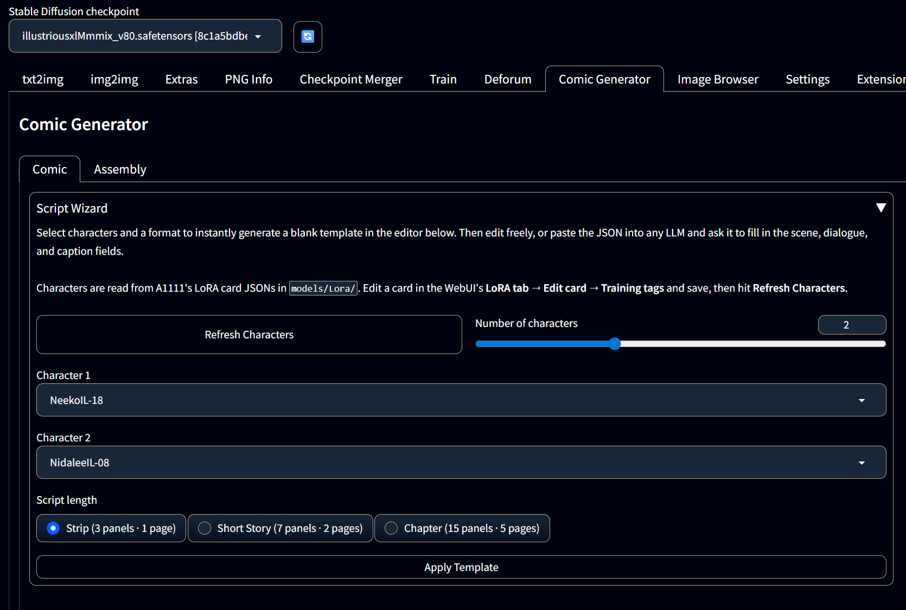
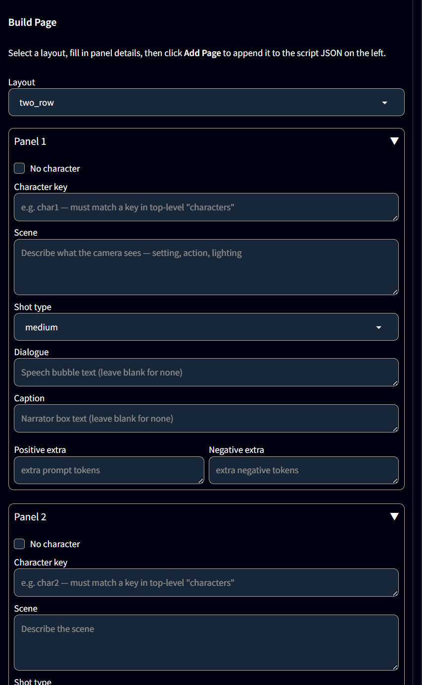
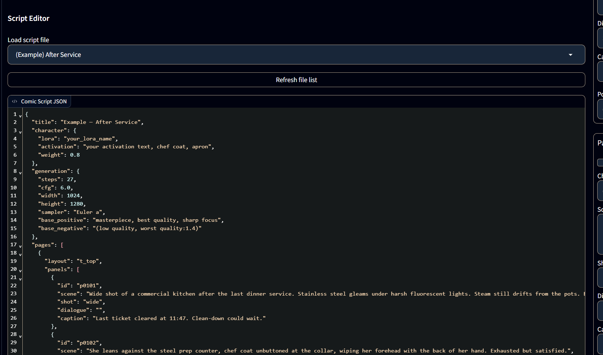
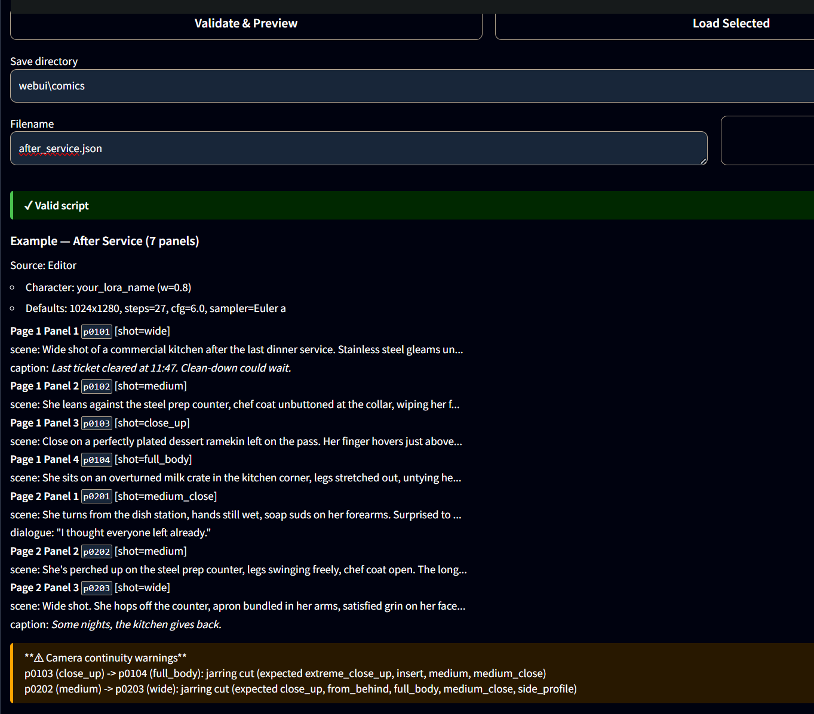
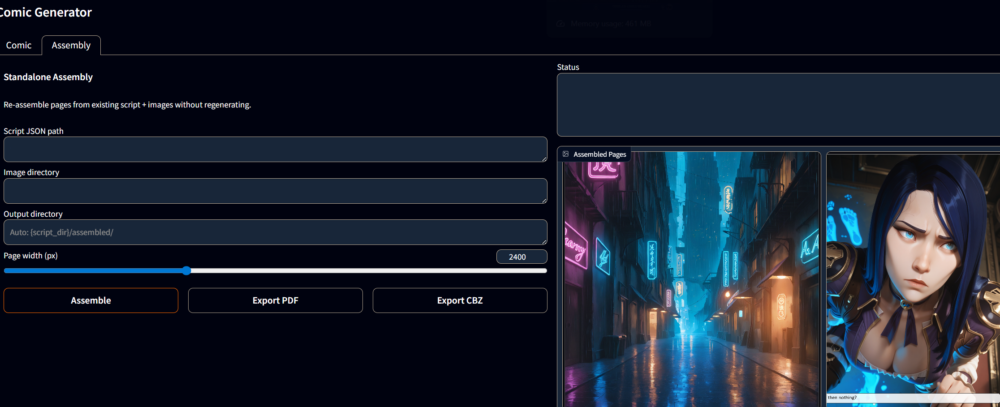

# sd-comic-ext

An A1111 WebUI extension that turns a JSON script into a full multi-page comic — panel generation, multi-candidate scoring, page assembly, and PDF/CBZ export, all inside your existing WebUI.



## What it does

- **Script-driven generation** — characters, layouts, scenes, camera angles, and dialogue in a single JSON file
- **12 page layouts** — splash, wide focus, two/three row, tall split, L-shapes, staircase, 2×2 grid, T-top/bottom, strip
- **Multi-candidate scoring** — generate N candidates per panel, auto-pick the best on sharpness, aesthetics, and CLIP content match
- **Scene-based seeding** — panels sharing a scene tag get consistent lighting and palette via deterministic seeds
- **img2img chaining** — reference earlier panels as init images for pose-to-pose continuity
- **Composite mode** — generate background and character separately, then rembg-mask the character onto the background
- **Camera vocabulary** — 11 shot types with diction variants, auto-inferred from scene text
- **Page assembly** — PIL-based layout engine with translucent caption bars and speech bubbles
- **Export** — PDF and CBZ

## Requirements

- [A1111 WebUI](https://github.com/AUTOMATIC1111/stable-diffusion-webui) (any recent version — the extension calls `modules.processing` directly, no API flag needed)
- Python 3.10+
- Character LoRAs with activation text
- [ADetailer](https://github.com/Bing-su/adetailer) (optional, recommended for face quality)

## Installation

Clone into your A1111 extensions folder:

```
cd stable-diffusion-webui/extensions
git clone https://github.com/Graceus777/sd-comic-ext.git
```

Restart the WebUI. `rembg` and `Pillow` install automatically on first launch via `install.py`. A **Comic Generator** tab appears with two sub-tabs: **Comic** and **Assembly**.

## Authoring a script

You have three ways to build a script, and you can mix them freely.

### 1. Script Wizard (scaffold a template)

An accordion at the top of the Comic tab. Pick up to 4 characters (read from `models/Lora/` card JSONs), choose a format (Strip / Short Story / Chapter), click **Apply Template**. The editor below fills with a valid JSON scaffold — panels with empty scene/shot/dialogue/caption fields ready to be filled in by you or an LLM.

### 2. Build Page (form-driven page authoring)



The Build Page form on the right side of the Comic tab is the quickest way to author a page without remembering JSON field names. Pick a layout, fill in the per-panel fields (character key, scene, shot type, dialogue, caption, extra prompt tokens), hit **Add Page**, and a properly-formed page block appends to the script editor on the left. Chain pages by changing the layout and repeating.

### 3. Write JSON directly



If you want full control, edit JSON in the Script Editor. The format is described below.

### Validate & Preview



Before you commit to a long generation run, click **Validate & Preview**. It parses the JSON, surfaces syntax errors with exact locations, confirms required fields are present, and — critically — flags layout/panel-count mismatches (e.g. `l_right` with only 2 panels). On success you get a panel-by-panel breakdown of what will be generated.

## Script format

```json
{
  "title": "My Comic",
  "characters": {
    "character_name": {
      "lora": "LoraFilename",
      "activation": "trigger words here",
      "weight": 0.85
    }
  },
  "generation": {
    "steps": 30,
    "cfg": 7.0,
    "width": 1024,
    "height": 1280,
    "sampler": "Euler a"
  },
  "pages": [
    {
      "layout": "l_right",
      "panels": [
        {
          "id": "p0101",
          "character": "character_name",
          "scene": "description of what the camera sees",
          "shot": "medium",
          "scene_tag": "kitchen_night",
          "dialogue": "optional speech bubble text",
          "caption": "optional narrator caption"
        }
      ]
    }
  ]
}
```

Useful panel fields beyond the basics:

- `no_character: true` — environment-only panel; LoRA excluded, person tags stripped, "no people, scenery" appended
- `scene_tag` — groups panels on a deterministic seed so they share lighting and palette
- `init_from` + `init_denoise` — chain img2img from an earlier panel for pose continuity
- `reuse` — skip generation and reuse an existing image on disk
- `_comment` fields are ignored by the parser

## Assembly and export



The **Assembly** sub-tab lets you re-assemble pages from an existing script + image directory without regenerating panels — useful when iterating on layouts or captions. Export the finished comic as PDF or CBZ.

## License

MIT
