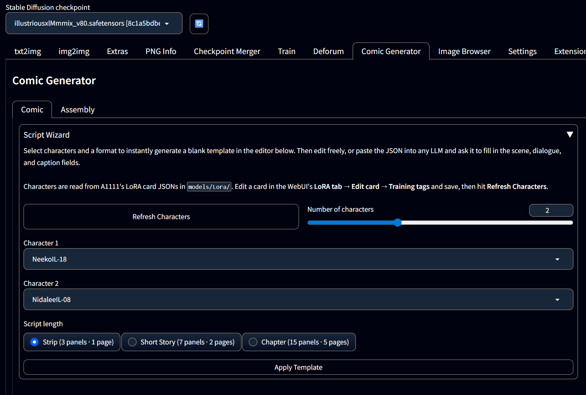
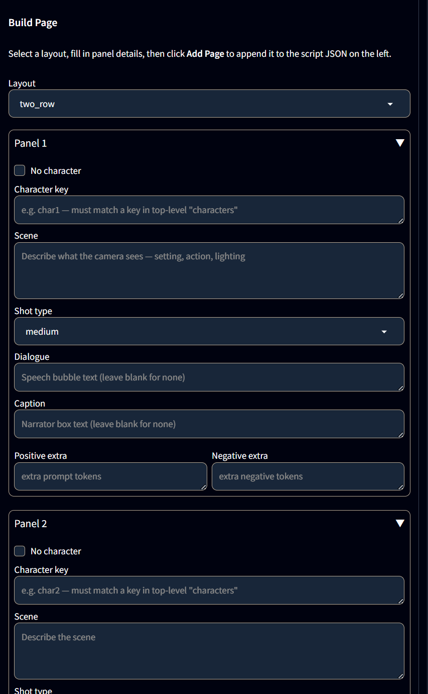
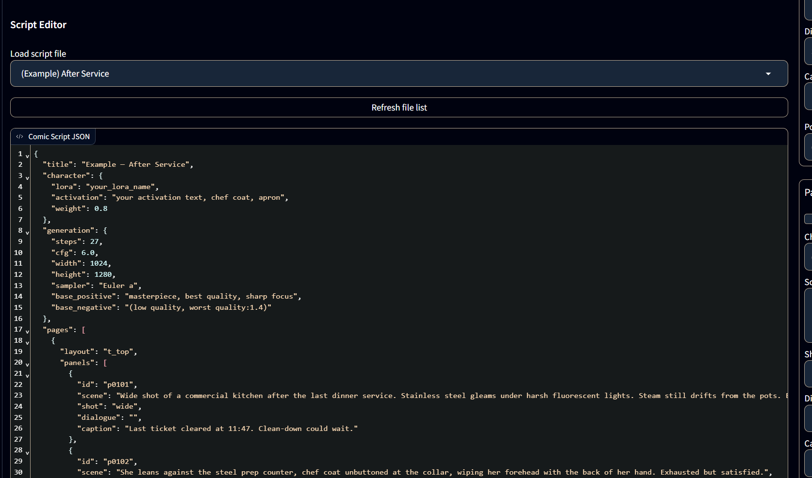
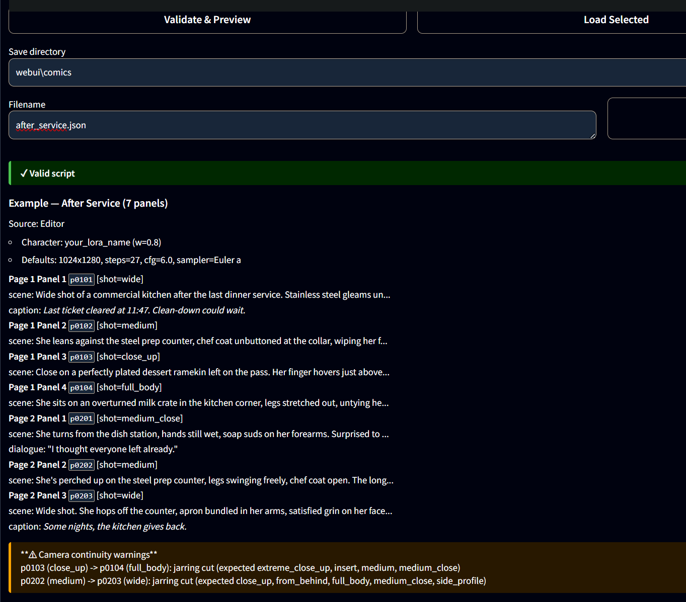
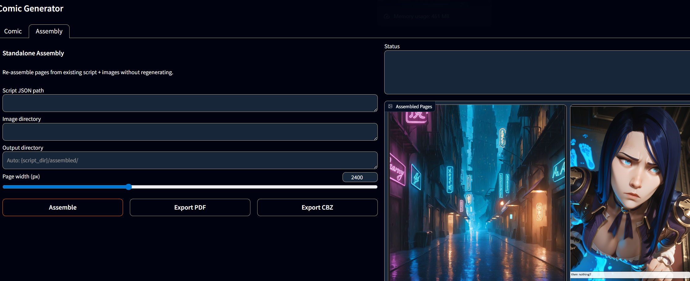

# sd-comic-ext

An A1111 WebUI extension that turns a JSON script into a full multi-page comic — panel generation, multi-candidate scoring, page assembly, and PDF/CBZ export, all inside your existing WebUI.



## What it does

- **Script-driven generation** — characters, layouts, scenes, camera angles, and dialogue in a single JSON file
- **12 page layouts** — splash, wide focus, two/three row, tall split, L-shapes, staircase, 2×2 grid, T-top/bottom, strip
- **Multi-candidate scoring** — generate N candidates per panel, auto-pick the best on sharpness, aesthetics, and CLIP content match
- **Scene-based seeding** — panels sharing a scene tag get consistent lighting and palette via deterministic seeds
- **img2img chaining** — reference earlier panels as init images for pose-to-pose continuity
- **Composite mode** — generate background and character separately, then rembg-mask the character onto the background
- **Camera vocabulary** — 11 shot types with diction variants, auto-inferred from scene text
- **Page assembly** — PIL-based layout engine with styleable caption boxes and speech/thought/shout/whisper bubbles, positioned per panel on a 9-grid
- **Visual lettering editor** — layer multiple bubbles, captions, exclamations, and boxless SFX with font, color, size, rotation, and placement controls
- **Export** — PDF and CBZ

## Requirements

- [A1111 WebUI](https://github.com/AUTOMATIC1111/stable-diffusion-webui) (any recent version — the extension calls `modules.processing` directly, no API flag needed)
- Python 3.10+
- Character LoRAs with activation text
- [ADetailer](https://github.com/Bing-su/adetailer) (optional, recommended for face quality)

## Installation

Clone into your A1111 extensions folder:

```
cd stable-diffusion-webui/extensions
git clone https://github.com/Graceus777/sd-comic-ext.git
```

Restart the WebUI. `rembg` and `Pillow` install automatically on first launch via `install.py`. A **Comic Generator** tab appears with four sub-tabs: **Comic**, **Font Editor**, **Touchup**, and **Assembly**.

## Authoring a script

You have three ways to build a script, and you can mix them freely.

### 1. Script Wizard (scaffold a template)

An accordion at the top of the Comic tab. Pick up to 4 characters (read from `models/Lora/` card JSONs), choose a format (Strip / Short Story / Chapter), click **Apply Template**. The editor below fills with a valid JSON scaffold — panels with empty scene/shot/dialogue/caption fields ready to be filled in by you or an LLM.

### 2. Build Page (form-driven page authoring)



The Build Page form on the right side of the Comic tab is the quickest way to author a page without remembering JSON field names. Pick a layout, fill in the per-panel fields (character key, scene, shot type, dialogue, caption, extra prompt tokens), hit **Add Page**, and a properly-formed page block appends to the script editor on the left. Chain pages by changing the layout and repeating.

### 3. Write JSON directly



If you want full control, edit JSON in the Script Editor. The format is described below.

### Validate & Preview



Before you commit to a long generation run, click **Validate & Preview**. It parses the JSON, surfaces syntax errors with exact locations, confirms required fields are present, and — critically — flags layout/panel-count mismatches (e.g. `l_right` with only 2 panels). On success you get a panel-by-panel breakdown of what will be generated.

## Script format

```json
{
  "title": "My Comic",
  "characters": {
    "character_name": {
      "lora": "LoraFilename",
      "activation": "trigger words here",
      "weight": 0.85
    }
  },
  "generation": {
    "steps": 30,
    "cfg": 7.0,
    "width": 1024,
    "height": 1280,
    "sampler": "Euler a"
  },
  "pages": [
    {
      "layout": "l_right",
      "panels": [
        {
          "id": "p0101",
          "character": "character_name",
          "scene": "description of what the camera sees",
          "shot": "medium",
          "scene_tag": "kitchen_night",
          "dialogue": "optional speech bubble text",
          "caption": "optional narrator caption"
        }
      ]
    }
  ]
}
```

Useful panel fields beyond the basics:

- `no_character: true` — environment-only panel; LoRA excluded, person tags stripped, "no people, scenery" appended
- `scene_tag` — groups panels on a deterministic seed so they share lighting and palette
- `init_from` + `init_denoise` — chain img2img from an earlier panel for pose continuity
- `reuse` — skip generation and reuse an existing image on disk
- `_comment` fields are ignored by the parser

### Lettering editor, fonts, bubbles, and effects

The **Font Editor** sub-tab is a visual lettering editor for text placement. Click **Refresh Panels**, choose a panel and layer, then edit and preview its preset, font family, 9-grid position, X/Y nudge, width, size, rotation, text color, and outline color. **Apply to Script** updates the selected dialogue/caption layer; **Add as New Layer** adds another independent bubble or effect. A panel can have any number of extra layers.

See the [Font Editor guide](docs/FONT_EDITOR.md) for the complete workflow, preset reference, JSON schema, and troubleshooting.

Built-in presets include:

- Bubbles: `speech`, `thought`, `shout` (exclamation burst), `whisper`, and `radio`
- Captions: `narration`, `caption_box`, `yellow_box`, and `parchment`
- Boxless effects: `sfx`, `sfx_speed`, `sfx_horror`, `sfx_electric`, and `sfx_subtle`
- Font families: comic, handwritten, impact/display, sans, serif, and monospace

Drop `.ttf`, `.otf`, or `.ttc` files into `sd-comic-ext/fonts/` and restart/reload the extension to expose them as **Custom** font choices. Scripts store a logical font name rather than a machine-specific system path.

The **Build Page** form also exposes preset and 9-grid position dropdowns. Scripts can use the full set of legacy dialogue/caption overrides:

- `dialogue_style` / `caption_style`
- `dialogue_anchor` / `caption_anchor`: `top-left`, `top-center`, `top-right`, `center-left`, `center`, `center-right`, `bottom-left`, `bottom-center`, or `bottom-right`
- `dialogue_offset` / `caption_offset`: `[x, y]` nudge as percentages of panel size
- `dialogue_width` / `caption_width`: layer width as a panel percentage
- `dialogue_font_size` / `caption_font_size`: base pixels at a 1200px panel width
- `dialogue_font` / `caption_font`, `*_rotation`, `*_color`, and `*_outline_color`

Independent layers are stored under `lettering` and render after caption/dialogue:

```json
{
  "id": "p0101",
  "scene": "hero braces against the blast",
  "dialogue": "Not today!",
  "dialogue_style": "shout",
  "dialogue_anchor": "top-center",
  "lettering": [
    {
      "id": "fx1",
      "text": "KRA-KOOM!",
      "style": "sfx_electric",
      "font": "impact",
      "anchor": "center-right",
      "offset": [-4, 3],
      "width": 58,
      "font_size": 68,
      "rotation": 8,
      "color": "#ffffff",
      "outline_color": "#2355e6"
    }
  ]
}
```

## Assembly and export



The **Assembly** sub-tab lets you re-assemble pages from an existing script + image directory without regenerating panels — useful when iterating on layouts or captions. Export the finished comic as PDF or CBZ.

## License

MIT
